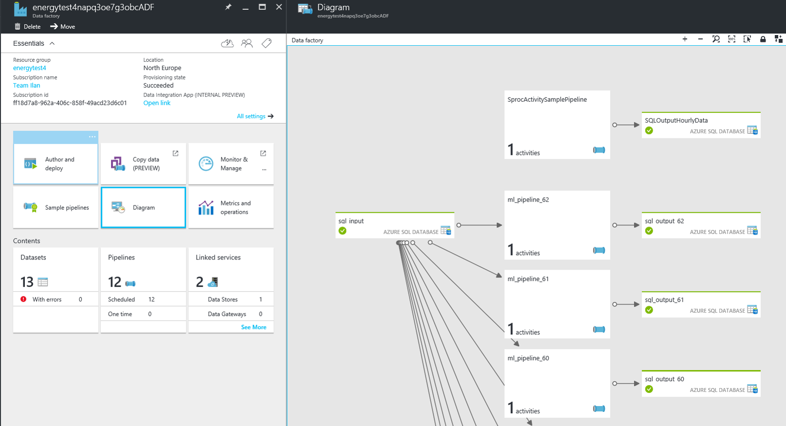
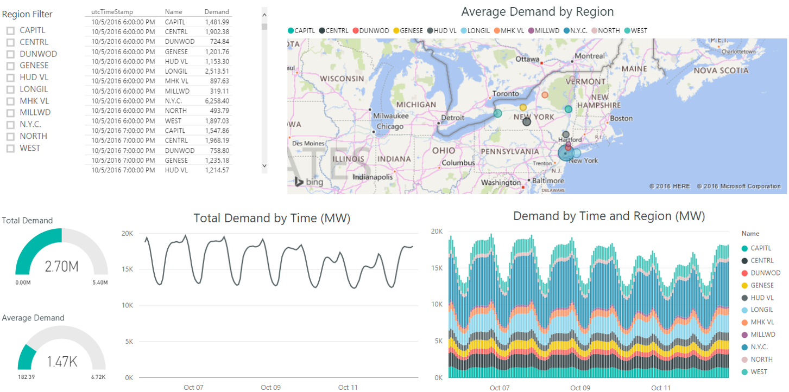

# Energy Demand Forecast Solution in Cortana Intelligence Suite


## Abstract 
This solution focuses on demand forecasting within the energy sector. Storing energy is not cost-effective, so utilities and power generators need to forecast future power consumption so that they can efficiently balance the supply with the demand. During peak hours, short supply can result in power outages. Conversely, too much supply can result in waste of resources. Advanced demand forecasting techniques detail hourly demand and peak hours for a particular day, allowing an energy provider to optimize the power generation process. This solution using Cortana Intelligence enables energy companies to quickly introduce powerful forecasting technology into their business.

This solution combines several Azure services to provide powerful advantages. Event Hubs collects real-time consumption data. Stream Analytics aggregates the streaming data and makes it available for visualization. Azure SQL stores and transforms the consumption data. Machine Learning implements and executes the forecasting model. PowerBI visualizes the real-time energy consumption as well as the forecast results. Finally, Data Factory orchestrates and schedules the entire data flow.


The published [Energy Demand Forecast Solution](https://go.microsoft.com/fwlink/?linkid=831187) provides one-click deployment of an energy demand forecast solution in Cortana Intelligence Suite. Advanced analytics solution implementers, i.e. Data Scientists and Data Engineers, usually need deeper understanding of the template components and architecture in order to use, maintain, and improve the solution. This documentation provides more details of the solution and step-by-step deployment instructions. Going through this manual deployment process will help implementers gain an inside view on how the solution is built and the function of each component.

## Requirements 

You will need the following accounts and software to create this solution:

- Source code and instructions from this GitHub repo

- A [Microsoft Azure subscription](<https://azure.microsoft.com/>) 

- An [Azure Machine Learning Studio account](<http://studio.azureml.net>)

- A Microsoft Office 365 subscription for Power BI access

- A network connection

- [SQL Server Management Studio](<https://msdn.microsoft.com/en-us/library/mt238290.aspx>), [Visual Studio](<https://www.visualstudio.com/en-us/visual-studio-homepage-vs.aspx>), or another similar tool to access a SQL server database.

- [Microsoft Azure Storage Explorer](<http://storageexplorer.com/>)

- [Power BI Desktop](<https://powerbi.microsoft.com/en-us/desktop>)

It will take about one day to implement this solution if you have all the required software/resources ready to use. The content of the document **Energy Demand Forecasting in Cortana Intelligence Suite_Deployment Guide.docx** is the same as this readme file. Use that documentation if you prefer reading a word document.

## Architecture


The figure above shows the overall architecture of the Energy Demand Forecast solution. There are two paths of the solution: real-time path on the top and batch path on the bottom.

In the real-time path:
- The data is simulated from **Azure Web Jobs** and feeds into the **Azure Event Hub**.

- We use **Azure Stream Analytics** to process the data and provide near real-time analytics on the input stream from the event hub and directly publish to **Power BI** for visualization.

In the batch path:
- The data is simulated from **Azure Web Jobs** and feeds into the **Azure SQL Database**.

- **Azure Machine Learning** service is used to make forecast on the energy demand of particular region given the inputs received.

- **Azure SQL Database** is used to store the prediction results received from the **Azure Machine Learning** service.

- **Azure Data Factory** handles orchestration, and scheduling of the hourly model retraining and reforecasting.

- Finally, **Power BI** is used for results visualization, so that users can monitor the energy consumption from each region and use the forecast demand to optimize the power generation or distribution process.

This architecture is an example that demonstrates one way of building energy forecast solution in Cortana Intelligence Suite. User can modify the architecture and include other Azure services based on different business needs.

## Setup Steps
This section walks the readers through the creation of each of the Cortana Intelligence Suite services in the architecture defined in Figure 1.
As there are usually many interdependent components in a solution, Azure Resource Manager enables you to group all Azure services in one solution into a [resource group](https://azure.microsoft.com/en-us/documentation/articles/resource-group-overview/#resource-groups). Each component in the resource group is called a resource.
We want to use a common name for the different services we are creating. The remainder of this document will use the assumption that the base service name is:

energytemplate\[UI\]\[N\]

Where \[UI\] is the users initials and N is a random integer that you choose. Characters must be entered in in lowercase. Several services, such as Azure Storage, require a unique name for the storage account across a region and hence this format should provide the user with a unique identifier.
So for example, Steven X. Smith might use a base service name of *energytemplatesxs01*  

**NOTE:** We create most resources in the South Central US region. The resource availability in different regions depends on your subscription. When deploying you own resources, make sure all data storage and compute resources are created in the same region to avoid inter-region data movement. Azure Resource Group and Azure Data Factory don’t have to be in the same region as the other resources. Azure Resource Group is a virtual group that groups all the resources in one solution. Azure Data Factory is a cloud-based data integration service that automates the movement and transformation of data. Data factory orchestrates the activities of the other services.

There are two paths: Batch path and Real-Time path.
Explain each path here.

## Batch Path Setup Steps

### 1. Create a new Azure Resource Group

  - Navigate to ***portal.azure.com*** and log in to your account

  - On the left tab click ***Resource Groups***
  
  - In the resource groups page that appears, click ***Add***
  
  - Provide a name ***energytemplate\_resourcegroup***
  
  - Select a ***location***. Note that resource group is a virtual group that groups all the resources in one solution. The resources don’t have to be in the same location as the resource group itself.
  
  - Click ***Create***

### 2. Setup Azure Storage account

An Azure Storage account is used by the Azure Machine Learning workspace in the Batch path. 

  - Navigate to ***portal.azure.com*** and log in to your account.

  - On the left tab click ***+ (New) > Storage > Storage Account***

  - Set the name to ***energytemplate[UI][N]***

  - Change the ***Deployment Model*** to ***Classic***

  - Set the resource group to the resource group we created by selecting the radio button ***Use existing***

  -  Location set to South Central US
	
  - Click ***Create***

  - Wait for the storage account to be created

Now that the storage account has been created we need to collect some information about it for other services like Azure Data Factory. 

  - Navigate to ***portal.azure.com*** and log in to your account

  - On the left tab click Resource Groups

  - Click on the resource group we created earlier ***energytemplate_resourcegroup***. If you don’t see the resource group, click ***Refresh*** 

  - Click on the storage account in Resources

  - In the Settings tab on the right, click ***Access Keys***

  - Copy the PRIMARY CONNECTION STRING and add it to the table below

  - Copy the Primary access key and add it to the table below

    | **Azure Storage Account** |                     |
    |------------------------|---------------------|
    | Storage Account        |energytemplate\[UI][N]|
    | Connection String      |             |
    | Primary access key     |             ||

### 3. Setup Azure SQL Server and Database

In this step, we will create an Azure SQL Database to store “actual” demand data generated by the data generator and forecasted demand data generated by Azure Machine Learning experiment. The data in Azure SQL Database are consumed by Power BI to visualize demand forecasting results and performance.

#### 1) Create Azure SQL Server and Database

- Navigate to ***portal.azure.com*** and login in to your account

- On the left tab click *** + (New) > Databases > SQL Database***

- Enter the name ***energytemplatedb*** for the database name

- Choose the resource group previously created ***energytemplate_resourcegroup***

- Under Server click the arrow and choose ***Create new server***
    - Name : energytemplate\[UI][N]
    
    - Enter in an administrator account name and password and save it to the table below.
    
    - Choose South Central US as the location to keep the SQL database in the same region as the rest of the services.
    
    - Click **Select**

- Once returned to the SQL Database tab, click ***Create***

- Wait for the database and server to be created. This may take few minutes.

- From ***portal.azure.com***, click on Resource Groups, then the group for this demo ***energytemplate_resourcegroup***.

- In the list of resources, click on the SQL Server that was just created.

- Under ***Settings*** for the new server, click ***Firewall*** and create a rule called ***open*** with the IP range of 0.0.0.0 to 255.255.255.255. This will allow you to access the database from your desktop. Click ***Save.***

    **Note**: This firewall rule is not recommended for production level systems but for this demo is acceptable. You will want to set this rule to the IP range of your secure system.
                
| **Azure SQL Database** |                     |
|------------------------|---------------------|
| Server Name            |energytemplate[UI][N]|
| Database               |energytemplatedb|
| User Name              |                     |
| Password               |                     ||


### 4. Setup Azure Web Job/Data Simulator

In this step, we will create Azure Web App Server to run several Web Jobs including the Data Simulator Web Jobs and few others.

#### 1) Create App Service and Service Plan 
- Navigate to ***portal.azure.com*** and login in to your account

- On the left tab click ***+ New > Web + Mobile > Web App***

- Enter the name ***energytemplate\[UI][N]*** for the Web App name

- Choose the resource group previously created ***energytemplate\_resourcegroup***

- Under App Service plan click the arrow and choose ***Create New***

    -   Name : energytemplate\[UI\]\[N\]

    -   Choose South Central US as the location to keep the Web App in the same region as the rest of the services.

    -   Click ***Ok***

- On the Web App tab > App Insights, click ***On*** 

- Click ***Create***

- Wait for the Web App to be created.

#### 2) Update App Service Settings

- We need to set up the Application Service settings which our web jobs will utilize

- From ***portal.azure.com,*** click on ***Resource Groups,*** then the group for this demo ***energytemplate\_resourcegroup.***

- In the list of resources, click on the Web App (App Service) that was just created

- In the Web App (App Service), go to ***Settings > Application Settings***

- In the newly opend tab, go to ***App settings*** section

- Under ***App settings*** you will find two empty columns named ***Key*** and ***Value***

    -   Enter following key value in the App Settings

        | **Azure App Service Settings** |             |
        |------------------------|---------------------|
        | Key                    | Value               |
        | SqlDriver              |SQL Server           |
        | SqlServer              |<energytemplate[UI][N]>|
        | SqlServerSuffix        |.database.windows.net|
        | SqlDatabase            |energytemplatedb     |
        | SqlUser                | \<SQL Server user name>|
        | SqlPassword            |\<SQL Server password> |
        | FiveMinsDataTable      |DemandHistory5Minutes|
        | FiveMinsSqlLogTable    |DemandHistory5Minutes_SQLLog|
        | WeatherDataTable       |WeatherHourly        |
        | WeatherSqlLogTable     |WeatherHourly_SQLLog |
        | StorageAccountName     |energytemplate\[UI][N]|
        | StorageKey             |\<Storage account Primary access key>|
        | MaxNumberResults     |55|
        | MaxHistoryHours     |24|
        | MaxDailyGapHours     |2||

- Click ***Save*** on top of the page to save the settings

#### 3) Upload Data Simulator Web Job 
We need to upload the web jobs which will generate the simulated energy data and also a web job to load historic weather/Energy Demand data int SQL Database. We have three web jobs for Batch Path. Web Job **PastData** creats tables, views and stored procedures that will be used by Azure Data Factory. We will more explain more details of the database objects in the Azure Data Factory section as they are closely related. It also loads the historic weather and energy demand data into **DemandHistory5Minutes** and **WeatherHourly**. The WebJob **FiveMinsDataToSQL** simulates energy consumption data and sends it to Azure SQL table **DemandHistory5Minutes** every 5 minutes. It also writes the execution log of the web job into **DemandHistory5Minutes\_SQLLog**, which helps to track failed jobs. Similarly, WebJob **WeatherHourlyDataToSQL** simulates weather data and sends it to Azure SQL table **WeatherHourly** every hour. It also writes corresponding run logs into **WeatherHourly\_SQLLog**.  
  
- Once you return to the App Service tab save, click on ***WebJobs*** under ***Settings***

##### 1) Add PastData Web Job 
- Click ***Add*** on top to upload the PastData job zip and provide following details:

     - Name : PastData

      - File Uplaod : browse to the directory where you downloaded the resource. Go to ***Data Simulator*** and select ***PastData.zip***
    
      - Type : Triggered

      - Triggers : Manual

      - Click ***Ok***

- Wait till the web job is added, then click refresh

- Once you see the web job ***PastData*** in the list, select it and click ***Run*** on the top of that tab

- Wait till the STATUS changes to Completed
      
##### 2) Add FiveMinsDataToSQL Web Job 
- Click ***Add*** on top to upload the Energy data simulator job zip and provide following details:

     - Name : FiveMinsDataToSQL

      - File Uplaod : browse to the directory where you downloaded the resource. Go to ***Data Simulator*** and select ***FiveMinsDataToSQL.zip***
    
      - Type : Triggered

      - Triggers : Manual

      - Click ***Ok***

- Wait till the web job is added, then click refresh

- Once you see the web job ***FiveMinsDataToSQL*** in the list, select it and click ***Run*** on the top of that tab

- Wait till the STATUS changes to Completed
      
##### 3) Add WeatherHourlyDataToSQL Web Job 
 -  Click ***Add*** again to upload the Weather data simulator job zip and provide following details:

       - Name : WeatherHourlyDataToSQL

       - File Uplaod : browse to the directory where you downloaded the resource. Go to ***Data Simulator*** and select ***WeatherHourlyDataToSQL.zip***
    
       - Type : Triggered

       - Triggers : Manual

       - Click ***Ok***

- Wait till the web job is added, then click refresh

- Once you see the web job ***WeatherHourlyDataToSQL*** in the list, select it and click ***Run*** on the top of that tab

- Wait till the STATUS changes to Completed

### 5. Setup Azure Machine Learning 

This section assumes that you have not set up any workspaces in Azure Machine Learning Studio but you do meet the requirements mentioned in the section before.

#### 1) Create Azure Machine Learning Workspace
The first thing we need to do is to create the workspace. A workspace is where Azure Machine Learning experiments are created. It is also tied to a storage account for intermediate results during experiment processing.

-  Navigate to **portal.azure.com** and login in with your Azure account.

-  On the left, click the **'+'** sign.

-  In pop out column, type in ***Azure Machine Learning*** in the search bar and then hit enter.

- From the next pop out column, choose **Machine Learning Workspace** and then in the new window click **Create**.

-  In the new window, entern the folllowing things:
  - Workspace name: *energysolution[UI][N]*.
  - Subscription: choose the one that you are using right now.
  - Resource group: choose the one that you have created.
  - Location: *South Central US*.
  - Storage account: select *Create new* and usually the storage name is automatically generated from your workspace name (i.e. *energysolution[UI][N]storage*). You can choose your own storage name as well.
  - Web service plan: choose *Create new* and then enter a name that you choose. Click *Web service plan pricing tier* to select the plan that you want.
  - Click *Create*.

Once the Azure Machine Learning Workspace is created, you will receive a *Deployments succeeded* massage on the portal, as well as an email notification.
Now that we have a workspace to work within, we can copy over the required experiment from the Cortana Intelligence Gallery.

#### 2) Get the energy forecast model

- Navigate to ***studio.azureml.net*** and log into your account

- In the upper right hand corner you will see a workspace name. If this does not match the name of the workspace we just created, use the arrow button to expose the workspace selection menu and choose the workspace *energysolution\[UI\]\[N\]*.

- Go to [Energy Demand Forecast Solution -Machine Learning Model Example](https://gallery.cortanaintelligence.com/Details/975ed028d71b490b9268d35094138358) in Cortana Intelligence Gallery.

- On the experiment page click the ***Open In Studio*** button

- In the dialog ***Copy experiment from Gallery***, choose appropriate location ***South Central US*** and the workspace we created earlier that you would like to copy it into. Click the **√** button.

- This process may take a minute and the experiment will open in the requested workspace.

- In the experiment you will see the two boxes in the beginning and end have a red sign. This is because you have not enter your database credentials yet. Click the boxes with the red sign, replace the following things with your own database credentials that you get from the previous steps.
  - Database server name
  - Database name
  - Server user account name
  - Server user account password


- Click ***RUN*** at the bottom of the experiment page. This step will take less than a minute to finish and all objects in the graph will have a green check box on them to indicate they have finished running.

- Click ***SET UP WEB SERVICE*** and choose ***Deploy Web Service [Classic]*** at the bottom of the page to create the Azure Web Service associated with the experiment. When completed, the browser will redirect to the web service home page.

    -   The web service home page can also be found by clicking the ***WEB SERVICES*** button on the left menu once logged in your workspace.

- Copy the ***API key*** from the web service home page and add it to the table below as you will need this information later.

- Click the link ***BATCH EXECUTION*** under the ***API HELP PAGE*** section. On the BATCH EXECUTION help page, copy the ***Request URI*** under the ***Request*** section and add it to the table below as you will need this information later. Copy only the URI part https:… /jobs, ignoring the URI parameters starting with ? .

| **Web Service BES Details** |                           |
| --------------------------- |--------------------------:|
| API Key                     | API key from API help page|
| Request URI\*               |                           ||

### 6. Setup Azure Data Factory (ADF)
Azure Data Factory can be used to orchestrate the entire data pipeline. In this solution, it is mainly used to schedule the data aggregation and model retraining. Here is an overview of the ADF pipeline.

**Data Aggregation Pipeline**: Simulated data from Azure web job are sent to Azure SQL every 5mins. When we are building machine learning model, we use hourly data. Therefore, we write a SQL procedure to aggregate the 5mins consumption data to hourly average consumption data. One pipeline is created in Azure Data Factory to trigger the procedure so that we always have the latest hourly consumption data.

**Model Training and Forecasting Pipelines**: There are 11 sub-regions in NYISO and we build one model for each region. Therefore, 11 pipelines are created in Azure Data Factory to trigger the Azure Machine Learning Web Service. Each pipeline sends data from a particular region to the web service and gets the latest retrained model and forecast results. All the results are written back to Azure SQL.

There are 3 main components of ADF: link service, dataset and pipeline. You can check the definition of each components [here](https://azure.microsoft.com/en-us/documentation/articles/data-factory-introduction/). In the following instructions, we will show you how to create them for this solution.

#### 1) Create Azure Data Factory


-   Navigate to ***portal.azure.com*** and login in to your account.

-   On the left tab click ***New&gt;Data and Analytics&gt;Data Factory***

-   Name: *energysolution\[UI\]\[N\]*

-   Resource Group: Choose the resource group created previously ***energysolution\_resourcegroup***

-   Location: EAST US

-   Click ***Create***

After the data factory is created successfully

-   On the left tab in the portal page (portal.azure.com), click ***Resource groups***

-   Search for the resource group created previously, ***energysolution\_resourcegroup***

-   Under Resources, click on the data factory we just created, *energysolution\[UI\]\[N\]*

-   Locate the ***Actions*** panel and click on ***Author and deploy***.

In the ***Author and deploy*** blade, we will create all the components of the data factory. Note that Datasets are dependent on Linked services, and pipelines are dependent on Linked services and Datasets. So we will create Linked services first, then Datasets, and Pipelines at last.


#### 2) Create Linked Services
We will create 2 Linked services in this solution. The scripts of the Linked services are located in the folder ***Azure Data Factory\\1-Linked Services*** of the solution package.

- **LinkedService-AzureSQL**: This is the Linked service for the Azure SQL database.

  -   Open the file ***Azure Data Factory\\1-Linked Services\\LinkedService-AzureSQL.json***. Replace the following items with your Azure SQL credentials.

    - Azure SQL server name

    - Azure SQL database name

    - Azure SQL login user name

    - Azure SQL login password

  -   Go back to ***Author and deploy*** in the data factory on ***portal.azure.com.***

  -   Click ***New data store*** and select ***Azure SQL***.

  -   Overwrite the content in the editor window with the content of the modified *LinkedService-AzureSQ.json*.

  -   Click ***Deploy***.

- **LinkedService-AzureML**: This is the Linked service for the Azure Machine Learning web service.

  -   Open the file ***Azure Data Factory\\1-Linked Services\\LinkedService-AzureML.json***. Replace the following items with your Azure ML Web Service information.

    - Azure Machine Learning web service URI

    - Azure Machine Learning web service API key

  -   Go back to ***Author and deploy*** in the data factory on ***portal.azure.com.***

  -   Click ***New compute*** and select ***Azure ML***.

  -   Overwrite the content in the editor window with the content of the modified LinkedService-AzureML.json.

  -   Click ***Deploy***.

#### 3) Create Datasets

We will create ADF datasets pointing to Azure SQL tables. We will use the JSON files located at ***Azure Data Factory\\2-Datasets***. No modification is needed on the JSON files.

- On ***portal.azure.com*** navigate to your data factory and click the ***Author and Deploy*** button.

For each JSON file under ***Azure Data Factory\\2-Datasets***:

-   At the top of the left tab, click ***New dataset*** and select ***Azure SQL***

-   Copy the content of the file into the editor

-   Click ***Deploy***

#### 4) Create Pipelines

We will create 12 pipelines in total. Here is a snapshot.



We will use the JSON files located at ***Azure Data Factory\\3-Pipelines.*** At the bottom of each JSON file, the “start” and “end” fields identify when the pipeline should be active and are in UTC time. You will need to modify the start and end time of each file to customize the schedule. For more information on scheduling in Data Factory, see [Create Data Factory](https://azure.microsoft.com/en-us/documentation/articles/data-factory-create-pipelines/) and [Scheduling and Execution with Data Factory](https://azure.microsoft.com/en-us/documentation/articles/data-factory-scheduling-and-execution/).

- Data aggregation pipeline

  This pipeline trigger the SQL procedure to aggregate the 5mins consumption data to hourly data.

  - Open the file ***Azure Data Factory\\3-Pipelines\\Pipeline-SQLProcedure.json***

  - Specify an active period that you want the pipeline to run. For example, if you want to test the template for 5 days, then set the start and end time as something like:

    ```JSON
    "start": "2016-11-01T00:00:00Z",
    "end": "2016-11-06T00:00:00Z",
    ```
    NOTE: Please limit the active period to the amount of time you need to test the pipeline to limit the cost incurred by data movement and processing.

  - On ***portal.azure.com*** navigate to your data factory and click the ***Author and Deploy*** button
  - At the top of the tab, click ***More commands*** and then ***New pipeline***

  - Copy the content of the modified JSON file into the editor

  - Click ***Deploy***

- Model training and forecasting pipelines

  There are 11 pipelines in total, one for each region. Each pipeline will send latest data for a particular region to machine learning model, trigger the web service so that the Azure machine learning will retrain based on the new data and reproduce the latest forecast. Then the results will be written back to SQL table. Below is the instruction for one region. User will need to repeat this for all the regions.

  - Open the file ***Azure Data Factory\\3-Pipelines\\Pipeline-ML-Region52.json***

  - Specify an active period that you want the pipeline to run. For example, if you want to test the template for 5 days, then set the start and end time as something like:

    ```JSON
    "start": "2016-11-01T00:00:00Z",
    "end": "2016-11-06T00:00:00Z",
    ```
    NOTE: Please make sure you put the same time range as you defined in other pipelines.

  - On ***portal.azure.com*** navigate to your data factory and click the ***Author and Deploy*** button.

  - At the top of the tab, click ***More commands*** and then ***New pipeline***

  - Copy the content of the modified JSON file into the editor

  - Click ***Deploy***

### 7. Setup Power BI
The essential goal of this part is to get the demand forecast of each region and visualize it. Power BI can directly connect to an Azure SQL database as its data source, where the prediction results are stored.

> Note:  1) In this step, the prerequisite is to download and install the free software [Power BI desktop](https://powerbi.microsoft.com/desktop). 2) We recommend you start this process 2-3 hours after you finish deploying the ADF pipelines so that you have more data points to visualize.

#### 1) Get the database credentials.

  You can get your database credentials from the previous steps when you setting up the SQL database.

#### 2)	Update the data source of the Power BI file

  -  Make sure you have installed the latest version of [Power BI desktop](https://powerbi.microsoft.com/desktop).

  -	In this Git repository, you can download the **'EnergyDemandForecastSolution.pbix'** file under the folder **'Power BI'** and then open it. **Note:** If you see an error massage, please make sure you have installed the latest version of Power BI Desktop.

  - On the top of the file, click **‘Edit Queries’** drop down menu. Then choose **'Data Source Settings'**.
  

  - In the pop out window, click **'Change Source'**, then replace the **"Server"** and **"Database"** with	your own server and database names and click **"OK"**. For server
	name, make sure you specify the port 1433 in the end of your server string
	(**YourSolutionName.database.windows.net, 1433**). After you finish editing, close the 'Data Source Settings' window.

  - When you are asked to enter the user name and password, make sure you choose **'Database'** option, then enter the username and password that you choose when you setting up the SQL database.

  - On the top of the screen, you will see a message. Click **'Apply Changes'** and now the dashboard is updated to connect to your database. In the backend, model is scheduled to be refreshed every 1 hour. You can click **'Refresh'** button on the top to get the latest visualization as time moving forward.

#### 3) [Optional] Publish the dashboard to [Power BIonline](http://www.powerbi.com/)
  Note that this step needs a Power BI account (or Office 365 account).
  - Click **"Publish"** on the top pannel. Choose **'My Workspace'** and few seconds later a window appears displaying "Publishing successed". Click the link on the screen to open it in a browser and enter your database credentials by following the instructions. To find detailed instructions, see [Publish from Power BI Desktop](https://support.powerbi.com/knowledgebase/articles/461278-publish-from-power-bi-desktop).

  - Now you can see new items showing under 'Reports' and 'Datasets'. To create a new dashboard: click the **'+'** sign next to the
    **Dashboards** section on the left pane. Enter the name "Energy Demand Forecasting Demo" for this new dashboard.

  - Once you open the report, click    to pin all the visualizations to your dashboard. To find detailed instructions, see [Pin a tile to a Power BI dashboard from a report](https://support.powerbi.com/knowledgebase/articles/430323-pin-a-tile-to-a-power-bi-dashboard-from-a-report). Here is an example of the dashboard.

      


## Real-time Path Setup Steps

### 1. Prepare the storage containers
We need to create a blob container to upload a GeoLocation file which will beconsumed in the Real-Time pipeline. Below are the steps to do so:

  - Download and install the [Microsoft Azure Storage Explorer](<http://storageexplorer.com/>)

  - Open the installed Azure Storage Explorer

  - Log in to your Microsoft account associated with your Azure Subscription. If you already logged in with an account, but want to use a different account, click the person icon and then click the “Add an account…” to log in with another account. 

  - Locate the storage account created in step 2 above and expand the nodes to see Blob Containers, etc.

  - Create a container named ***demandforecasting***

     - Right click on Blob Containers and choose Create Blob Container

     - Enter the container name ***demandforecasting***

  - Double click the demandforecasting container
	
  - In the right panel, above the container listing, click the arrow on the Upload button and choose Upload File

  - Browse to the ***Data*** folder in the solution package, select the file ***RegionLookup.csv*** and upload it. This will upload the reference geography data of the stations.


### 2. Setup Azure Event Hub

Azure Event Hub is a highly scalable service that can ingest millions of records per second. This will be the ingestion point for the smart meter reading data.

#### 1) Create Event Hub Namespace
- Navigate to ***portal.azure.com*** and log in to your account.

- On the left tab click ***Resource Groups***

- Click on the resource group we created earlier ***energytemplate_resourcegroup*** 

- On the resource page click ***Add***

- On the page that appears on the right, type ***Event Hubs*** in the search box. 

- Choose ***Event Hubs***

- Click ***Create*** on the page that comes up. This will create the namespace for Event Hub

    - Enter the name for namespace as energytemplate\[UI\]\[N\]-ns

    - Select Resource Group ***energytemplate_resourcegroup***

    - Set Location to *South Central US*

- Click on ***Create*** 

#### 2) Create Event Hub and Consumer Groups

- Once the Event Hubs Namespace is created, go to the resource group ***energytemplate_resourcegroup*** and select the newly created ***Event Hubs*** namespace.

- Click on ***+ Event Hub*** to add Event Hub to this namespace

    - Enter the name energytemplate\[UI\]\[N\]

    - Enter *Partition Count* as 4 and *Message Retention* as 7

- Click on ***Create*** 

This creates the Azure Event Hub we need to receive the smart meter readings. The Event Hub will be consumed by two Azure Stream Analytics jobs. To ensure processing of the hub is successful we need to create two [consumer groups](https://azure.microsoft.com/en-us/documentation/articles/event-hubs-programming-guide/#event-consumers) on the hub.

- Browse to the Event Hub namespace under the resource group ***energytemplate_resourcegroup***

- The event hub we have created above (energytemplate\[UI\]\[N\]) should be highlighted.If you don’t see the event hub, click ***Refresh***

- Select the newly created Event Hub

- Click the ***+ CREATE CONSUMER GROUP*** at the top of the right pane and add in “democg” as the consumer group name.

Finally, we are going to need some information about this event hub for our event generation application that will feed the event hub.

- Browse again to the Event Hub namespace under the resource group ***energytemplate_resourcegroup***

- On the right panel, click on ***Connection Strings***

- Select policy ***RootManageSharedAccessKey***

- On the newly open right tab, Copy the ***Connection string–primary key***

- Also copy and note the ***Primary Key***

The connection string and event hub name information will be needed to configure the data generation web job that simulates smart meter readings being sent to the event hub.

| **Azure Event Hub** |                        |
|---------------------|------------------------|
| Event Hub           |energytemplate[UI][N]   |
| Namespace           |energytemplate[UI][N]-ns|
| Connection String   |                        |
| Primary Key         |                       ||


### 3. Setup Azure Web Jobs

#### 1) Update App Service Settings 

We need to set up the Application Service settings which our data simulator web job for Event Hub will utilize

- In the list of resources, click on the Web App (App Service) that was just created

- In the Web App (App Service), go to ***Settings > Application Settings***

- In the newly opend tab, go to ***App settings*** section

- Under ***App settings*** you will find two empty columns named ***Key*** and ***Value***

    -   Enter following key value in the App Settings

        | **Azure App Service Settings** |             |
        |------------------------|---------------------|
        | Key                    | Value               |
        | EventHubServiceNamespace|energytemplate[UI][N]-ns]|
        | EventHubServicePolicy  |RootManageSharedAccessKey|
        | EventHubServiceKey     |\<Event Hub Primary Key>|
        | EventHub               |energytemplate[UI][N]|
        | FiveMinsEhLogTable  |DemandHistory5Minutes_EHLog||

- Click ***Save*** on top of the page to save the settings

#### 2) Upload Data Simulator Web Job 
We need to upload the web jobs which will generate the simulated energy data. We have one web job for Real-time Path. The WebJob **FiveMinsDataToEH** simulates energy consumption data and sends it to Azure Event Hub. It also writes the execution log of the web job into **DemandHistory5Minutes\_EHLog**, which helps to track failed jobs. 

- Once you return to the App Service tab after save, click on ***WebJobs*** under ***Settings***

- Click ***Add*** on top to upload the Energy data simulator job zip and provide following details:

    - Name : FiveMinsDataToEH

    - File Uplaod : browse to the directory where you downloaded the resource. Go to ***Data Simulator*** and select ***FiveMinsDataToEH.zip***
    
    - Type : Triggered

    - Triggers : Manual

    - Click ***Ok***

- Wait till the web job is added, then click refresh

- Once you see the web job ***FiveMinsDataToEH*** in the list, select it and click ***Run*** on the top of that tab

- Wait till the STATUS changes to Completed

### 4. Azure Stream Analytics Job 
In this solution, we will show you how to use Stream Analytics Job to join a real-time data stream with reference data and push it to Power BI for real-time visualizations. Besides this, Stream Analytics Job is very powerful at analyzing real-time data. For other examples, you can check [here](https://azure.microsoft.com/en-us/documentation/articles/stream-analytics-twitter-sentiment-analysis-trends/).

#### 1) Provision a Stream Analytics job

-   Navigate to ***portal.azure.com*** and login in to your account.

-   On the left tab click ***New > Intelligence + analytics > Stream Analytics Job***

-   Name: *energysolution\[UI\]\[N\]*

-   Resource Group: Choose the resource group created previously ***energysolution\_resourcegroup***

-   Location: EAST US

-   Click ***Create***

After the Stream Analytics Job is created successfully, you will be guided to the job page.
 Notice that the **START** button on the top of the page is disabled. You must configure the job input, output, and query before you can start the job.

#### 2) Specify stream analytics job input

- Setup stream data input
  - In your Stream Analytics job, click **INPUTS**, and then click **+ ADD** on the top. The dialog box that opens will show things that you need to set up in your input.
    - Input alias: InputEventHub
    - Source Type: Data Stream
    - Source: Event Hub
    - Subscription: Select the one that you are using to set up the Event Hub, usually is the current subscription
    - Service bus namespace: same as the one you set up in the previous step
    - Event hub name: same as the one you set up in the previous step
    - Event hub policy name: RootManageSharedAccessKey
    - Event hub consumer group: “democg”
    - Event serialization format: JSON
    - Encoding: UTF-8
  - Click ***Create***


- Reference data input
  - In your Stream Analytics job, click **INPUTS**, and then click **+ ADD** on the top. The dialog box that opens will show things that you need to set up in your input.
    - Input alias: InputBlobRefData
    - Source Type: Reference Data
    - Subscription: Select the one that you are using to set up the Event Hub, usually is the current subscription
    - Storage account: same as the one you set up in the previous step
    - Storage account key: same as the one you set up in the previous step
    - Container: same as the one you set up in the previous step
    - Path pattern: the path of your file including file name. Usually is 'RegionLookup.csv'
    - Date format: use the default
    - Time format: use the default
    - Event serialization format: csv
    - Delimiter: comma(,)
    - Encoding: UTF-8
  - Click ***Create***

#### 3) Specify job query
Stream Analytics supports a simple, declarative query model that describes transformations for real-time processing. To learn more about the language, see the [Azure Stream Analytics Query Language Reference](https://msdn.microsoft.com/library/dn834998.aspx).

Now we will create the queries for the jobs:

- Click ***QUERY***

- In the query box, copy the content of the file in this location ***Azure Stream Analytics//StreamAnalyticsJob-Query.txt***

- Click ***Save*** at the bottom of the page


#### 4) Specify job output

  - You can use the instructions in
[Azure Stream Analytics & Power BI: A real-time analytics dashboard for real-time visibility of streaming data](https://azure.microsoft.com/en-us/documentation/articles/stream-analytics-power-bi-dashboard/)
to set up the output of your Azure Stream Analytics job as your Power BI dashboard.

  - Locate the stream analytics job in your [Azure management portal](https://portal.azure.com). The name of the job should be: ***energytemplate\[UI][N]*** (i.e. energydemosaJob). Click **'Outputs'** from the panel on the right.

  

  - On the new window, click **'+Add'** on the top, and then it will show a window asking for information of the output. Under **'Sink'**, choose **'Power BI'**, then click **'Authorize'**. In the pop out window, log in with your Power BI account.

  - Once you successfully authorize your Power BI account, fill in other informtion as follows. Set the **Output Alias** as **'outputPBI'**. Set your **'Dataset Name'** and **'Table Name'** as **'EnergyForecastStreamData'**. Click **'Create'** once you finish.

#### 5) Start job for real-time processing
Because job input, query, and output have all been specified, we are ready to start the Stream Analytics job.

-	From the job **DASHBOARD**, click **START**  at the top of the page.

-	In the dialog box that opens, click **JOB START TIME**, and then click the **CHECK** button on the bottom of the dialog box. The job status will change to **Starting** and will shortly change to **Running**.

- You will get a confirmation message (e.g. 'Streaming Job started successfully') once everything is set up correctly.

### 5. Setup Real-time Power BI 
#### 1) Login on [Power BI online](http://www.powerbi.com)

-   On the left panel Datasets section in My Workspace, you should be able to see a new dataset showing on the left panel of Power BI. This is the streaming data you pushed from Azure Stream Analytics in the previous step.

-   Make sure the ***Visualizations*** pane is open and is shown on the
    right side of the screen.

#### 2) Create a visulization on PowerBI online
With Power BI, you are enabled to create many kinds of visualizations for your business needs. We will use this example to show you how to create the "Demand by Timestamp" real-time line chart tile.

-	Click dataset **EnergyForecastStreamData** on the left panel Datasets section.

-	Click **"Line Chart"** icon.

-	Click EnergyForecastStreamData in **Fields** panel.

-	Click **“time”** and make sure it shows under "Axis". Click **“demand”** and make sure it shows under "Values".

-	Click **'Save'** on the top and name the report as “EnergyStreamDataReport”. The report named “EnergyStreamDataReport” will be shown in Reports section in the Navigator pane on left.

-	Click **“Pin Visual”** icon on top right corner of this line chart, a "Pin to Dashboard" window may show up for you to choose a dashboard. Please select "EnergyStreamDataReport", then click "Pin".

- Once the visualization is pinned to dashboard, it will automatically refresh when Power BI receive new data from stream analytics job.

## Validation and Results
need to discuss if we want to keep this
